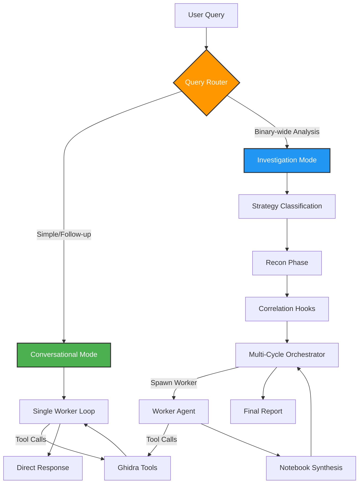

# OGhidra - AI-Powered Reverse Engineering with Ghidra
### Try with gemini-3.1-flash-lite-preview for insanely fast Zero-Day Hunting


**OGhidra** bridges Large Language Models with Ghidra's reverse engineering platform, enabling AI-driven binary analysis through natural language. Analyze binaries conversationally, automate complex workflows, and maintain complete privacy with local AI models.
YouTube Setup Tutorial

[](https://www.youtube.com/watch?v=hBD92FUgR0Y)


---

## What is OGhidra?

OGhidra enhances Ghidra with AI capabilities, allowing you to:

- **Conversational Analysis** - Ask questions and get answers naturally, with full conversation context
- **Automated Workflows** - Rename functions, detect patterns, generate comprehensive reports
- **Multi-Agent Orchestration** - Complex investigations use specialized workers for deep analysis
- **Local AI Models** - Complete privacy with models running on your hardware (Ollama)
- **Cloud AI Support** - Connect to external APIs (Google Gemini, OpenAI, Anthropic Claude)
- **Artifact Detection** - Real-time security pattern scanning across 19 vulnerability indicators
- **Smart Enumeration** - Build queryable knowledge graphs from binary analysis

### How It Works



**Two execution modes** selected automatically per query:

- **Conversational** (default) - Single worker loop for questions, follow-ups, renames, quick lookups. Like a natural conversation. 2-5 LLM calls per query.
- **Investigation** - Full orchestrator with recon, correlation hooks, and multi-cycle workers for binary-wide vulnerability hunting, malware analysis, or architecture mapping. Triggered automatically when the query demands deep analysis.

---

## Quick Start

### Prerequisites

1. **Python 3.12+** - Check version: `python --version`
2. **Ghidra 12.0.3** (Recommended) - Download from [Ghidra Releases](https://github.com/NationalSecurityAgency/ghidra/releases)
   - Minimum supported: Ghidra 11.0.3+
   - Tested with: Ghidra 11.0.3, 11.3.2, 12.0.2, 12.0.3
3. **Java 17+** - Required for Ghidra: `java -version`
4. **Ollama** (for local models) - Install from [ollama.com](https://ollama.com/)

### Installation

```bash
# Clone repository
git clone https://github.com/LLNL/OGhidra.git
cd OGhidra

# Install dependencies (choose one)
uv sync                          # Using UV (recommended)
pip install -r requirements.txt  # Using pip

# Configure environment
cp .env.example .env
# Edit .env with your settings
```

### Setup Ghidra Plugin

The OGhidraMCP plugin supports both Ghidra 11.3.2+ and Ghidra 12.0.3 (recommended).
Theres also a youtube video https://www.youtube.com/watch?v=hBD92FUgR0Y

1. **Identify the OGhidraMCP plugin**:
   ```bash
   # The plugin is: OGhidraMCP_1-9.zip or OGhidra_1-9_11.zip for the Ghidra 11.3.2
   ```

2. **Install in Ghidra**:
   - Open Ghidra -> **File** -> **Install Extensions**
   - Click **Add Extension** (green plus icon)
   - Select the correct `OGhidraMCP.zip` for your Ghidra version
   - Restart Ghidra

3. **Enable the plugin**:
   - Open a Ghidra project
   - **File** -> **Configure** -> Search "OGhidraMCP"
   - Check the box to enable
   - The server will start on `http://localhost:8080`

   > **Note**: The plugin is compatible with Ghidra 11.0.3+ and optimized for Ghidra 12.0.3

### Pull AI Models

```bash
# For Ollama (local models)
ollama pull gemma3:27b           		# Good balance (20GB RAM)
ollama pull nomic-embed-text     		# Embedding model for RAG

# Alternative models
ollama pull gpt-oss:120b         		# High quality (80GB RAM)
ollama pull devstral-2:123b 			# High quality (80GB RAM)
ollama pull devstral-2:123b-cloud       # Cloud Model
```

### Launch OGhidra

```bash
# GUI Mode (recommended)
uv run main.py --ui

# Interactive CLI
uv run main.py --interactive

# Test connection
health
```

---

## Configuration

Edit `.env` to configure your AI provider:

### Option 1: Local Models (Ollama)

```env
LLM_PROVIDER=ollama
OLLAMA_BASE_URL=http://localhost:11434/
OLLAMA_MODEL=gemma3:27b
OLLAMA_EMBEDDING_MODEL=nomic-embed-text
```

### Option 2: External APIs

```env
LLM_PROVIDER=external
EXTERNAL_PROVIDER=google
EXTERNAL_API_KEY=your-api-key-here
EXTERNAL_MODEL=gemini-3.1-flash-lite-preview
EXTERNAL_EMBEDDING_MODEL=gemini-embedding-001
```

### Option 3: Custom OpenAI-Compatible API

```env
LLM_PROVIDER=custom_api
CUSTOM_API_URL=https://api.example.com/v1/chat/completions
CUSTOM_API_KEY=your-api-key-here
CUSTOM_API_MODEL=your-model-name
CUSTOM_API_EMBEDDING_MODEL=your-embedding-model
```

### Orchestrator Settings

```env
# Safety ceilings (the LLM decides when to stop; these are hard limits)
ORCHESTRATOR_MAX_CYCLES=15         # Max investigation cycles
WORKER_DEFAULT_MAX_STEPS=20        # Max tool calls per worker

# Context budget in tokens
CONTEXT_BUDGET=100000              # 100K for mid-size, 200K+ for frontier models
```

---

## Key Features

### 1. Conversational Analysis

Ask questions naturally. OGhidra maintains conversation context across queries:

```
You: "What does this function do?"
AI:  [decompiles function, analyzes] "FUN_00404650 is a Window Procedure..."

You: "Is there a vulnerability here?"
AI:  [examines code paths] "Yes, FUN_00401000 has a buffer overflow..."

You: "Can you verify that?"
AI:  [traces callers, checks bounds] "Confirmed: uninitialized pointer in logging..."
```

No mode switches needed. Context carries forward automatically.

### 2. Automated Investigation

For binary-wide analysis, the orchestrator activates automatically:

```
You: "Find all vulnerabilities in this binary"
AI:  [recon -> correlation hooks -> multi-cycle analysis -> report]
```

The investigation system includes:
- **Recon Phase** - Maps imports, exports, strings (cached for follow-ups)
- **Correlation Hooks** - 5 built-in vulnerability patterns (unquoted paths, DLL hijacking, command injection, privilege escalation, directory traversal)
- **Recipe System** - Deterministic API tracing without LLM overhead
- **Coverage Tracking** - Ensures no security area is missed
- **Diminishing Returns Detection** - Stops when analysis plateaus

### 3. Smart Tool Buttons (GUI)

| Tool | Description |
|------|-------------|
| **Analyze Current Function** | Deep dive into selected function's behavior |
| **Rename Current Function** | AI suggests meaningful names based on analysis |
| **Rename All Functions** | Bulk rename with Smart/Full/Rename-Only options |
| **Analyze Imports** | Identify libraries and external dependencies |
| **Analyze Strings** | Find URLs, credentials, configuration data |
| **Generate Report** | Comprehensive security assessment |

### 4. Artifact Detection

Real-time scanning of tool results for 19 security patterns:
- **Privilege Escalation**: SeDebugPrivilege, AdjustTokenPrivileges, token manipulation
- **Crypto/Credentials**: CryptEncrypt, hardcoded passwords, embedded private keys
- **C2 Indicators**: Hardcoded IP URLs, network callbacks
- **Code Injection**: VirtualAlloc+PAGE_EXECUTE, WriteProcessMemory, remote threads
- **Anti-Analysis**: IsDebuggerPresent, NtQueryInformationProcess

Detected artifacts are automatically promoted to the investigation notebook.

### 5. Plugin-Style Extensions

Extend OGhidra with custom recipes and correlation hooks:

```python
# Custom recipe (save as .py in CUSTOM_RECIPES_DIR)
from src.recipe_registry import BaseRecipe

class MyRecipe(BaseRecipe):
    name = "trace_crypto_calls"
    description = "Trace all cryptographic API callers"

    def execute(self, executor, params):
        return executor.trace_import_callers(
            api_names=["CryptEncrypt", "BCryptEncrypt"]
        )
```

```python
# Custom correlation hook (save as .py in CUSTOM_HOOKS_DIR)
from src.correlation_hooks import CorrelationHook

class MyHook(CorrelationHook):
    name = "custom_pattern"
    description = "Detect my custom vulnerability pattern"

    def check(self, all_apis, coverage, fn_registry, discovery):
        if "dangerous_api" in all_apis:
            return WorkerTask(goal="Investigate dangerous_api usage")
        return None
```

### 6. Session Persistence

Analysis state carries across queries within a session:
- **Function Registry** - All analyzed functions accumulate
- **Discovery Cache** - Imports/exports/strings cached from first recon
- **Conversation History** - Follow-up questions reference prior answers
- **Investigation Notebook** - Findings persist for the session

---

## Common Workflows

### Analyze a Suspicious Binary

1. **Load binary in Ghidra** and open in CodeBrowser
2. **Enable OGhidraMCP plugin** (File -> Configure)
3. **Launch OGhidra**: `uv run main.py --ui`
4. **Ask questions conversationally**:
   - "What is this binary?"
   - "Is there anything suspicious in the imports?"
   - "Find all vulnerabilities" (triggers full investigation)

### Investigate Specific Function

1. **Navigate to function in Ghidra**
2. **Ask about it**: "What does this function do?"
3. **Dig deeper**: "Is this vulnerable?" -> "Can you verify that?" -> "Check the callers too"

### Generate Security Report

```bash
# In GUI: Click "Generate Report" button
# Or ask: "Generate a comprehensive security report"
# Report includes:
- Executive Summary with Verdict
- Confirmed Findings with evidence
- Areas requiring further investigation
- Coverage metrics
```

---

## Architecture Overview

```
                          ┌──────────────────────┐
                          │     User Query       │
                          └──────────┬───────────┘
                                     │
                          ┌──────────▼───────────┐
                          │    Query Router      │
                          │  (1 LLM call: route  │
                          │  + classify strategy)│
                          └─────┬──────────┬─────┘
                                │          │
                    ┌───────────▼──┐  ┌────▼────────────┐
                    │Conversational│  │  Investigation  │
                    │    Mode      │  │     Mode        │
                    └───────┬──────┘  └────┬────────────┘
                            │              │
               ┌────────────▼──┐   ┌───────▼───────────────────┐
               │ Single Worker │   │ Orchestrator              │
               │    Loop       │   │  ├─ Recon Phase           │
               │               │   │  ├─ Correlation Hooks     │
               │ LLM sees:     │   │  ├─ Multi-Cycle Loop      │
               │ • Tools       │   │  │  └─ Worker → Synthesis │
               │ • History     │   │  └─ Final Report          │
               │ • Blackboard  │   └───────────────────────────┘
               └───────┬───────┘               │
                       │                       │
                       ▼                       ▼
              ┌─────────────────────────────────────────┐
              │            Shared Blackboard            │
              │  ┌────────────┐  ┌────────────────────┐ │
              │  │ Function   │  │ Discovery Cache    │ │
              │  │ Registry   │  │ (imports/exports)  │ │
              │  ├────────────┤  ├────────────────────┤ │
              │  │ Coverage   │  │ Tool Health        │ │
              │  │ Tracker    │  │ Tracker            │ │
              │  ├────────────┤  ├────────────────────┤ │
              │  │ Notebook   │  │ Conversation       │ │
              │  │ (findings) │  │ History            │ │
              │  └────────────┘  └────────────────────┘ │
              └──────────────────┬──────────────────────┘
                                 │
                    ┌────────────▼────────────┐
                    │     Tool Executor       │
                    │  ┌──────────────────┐   │
                    │  │ LazyGhidraClient │   │
                    │  │ (defers connect  │   │
                    │  │  to first use)   │   │
                    │  └──────────────────┘   │
                    │  ┌──────────────────┐   │
                    │  │ LLM Clients      │   │
                    │  │ • Ollama (local) │   │
                    │  │ • Google Gemini  │   │
                    │  │ • Custom API     │   │
                    │  └──────────────────┘   │
                    └─────────────────────────┘
```

### Key Components

| Component | File | Purpose |
|-----------|------|---------|
| **Orchestrator** | `src/orchestrator.py` | Query routing, investigation planning, worker coordination |
| **Worker Agent** | `src/agents/worker_agent.py` | Tool execution loop (conversational + investigation) |
| **Blackboard** | `src/blackboard.py` | Shared investigation state across queries |
| **Recipe Executor** | `src/recipes.py` | Deterministic API tracing (no LLM overhead) |
| **Recipe Registry** | `src/recipe_registry.py` | Plugin system for custom analysis recipes |
| **Correlation Hooks** | `src/correlation_hooks.py` | Extensible vulnerability pattern detection |
| **Tool Health** | `src/tool_health.py` | Cross-worker tool failure tracking |
| **Artifact Scanner** | `src/artifact_scanner.py` | Real-time security pattern matching |
| **Config Loader** | `src/config_loader.py` | Multi-level config (user/project/env) |
| **Lazy Ghidra** | `src/lazy_ghidra.py` | Deferred connection proxy |

---

## Advanced Features

### Multi-Level Configuration

OGhidra supports configuration hierarchy (higher priority overrides lower):

1. **User-level**: `~/.oghidra/config.json`
2. **Project-level**: `.oghidra/config.json`
3. **Environment variables** (highest priority)

### RAG (Retrieval-Augmented Generation)

OGhidra uses vector embeddings for semantic search over analyzed functions:

```env
# Enable in .env
RESULT_CACHE_ENABLED=true
TIERED_CONTEXT_ENABLED=true
```

### LLM Logging

Track all AI interactions for debugging:

```env
LLM_LOGGING_ENABLED=true
LLM_LOG_FILE=logs/llm_interactions.log
LLM_LOG_FORMAT=json
```

---

## Troubleshooting

### Ghidra Connection Issues

```bash
# Verify plugin is loaded
# Open up codebrowser!

# Check server is running
curl http://localhost:8080/methods
```

### Ollama Connection Issues

```bash
# Verify Ollama is running
ollama list

# Check connectivity
curl http://localhost:11434/api/tags

# Restart Ollama service
ollama serve
```

### Slow Performance

1. **Use smaller models**: Switch to `gemma3:9b`
2. **Reduce parallel workers**: Set `max_workers=2` in bulk operations
3. **Disable vector embeddings**: `RESULT_CACHE_ENABLED=false`
4. **Increase request delay**: `CUSTOM_API_REQUEST_DELAY=2.0`

---

## Contributing

We welcome contributions! Areas of interest:

- **Custom correlation hooks** for new vulnerability patterns
- **Custom recipes** for specialized analysis workflows
- **LLM provider integrations** (AWS Bedrock, Azure OpenAI)
- **UI/UX improvements**
- **Performance optimizations**
- **Documentation** and examples

See [CODE_OF_CONDUCT.md](CODE_OF_CONDUCT.md) for community guidelines.

---

## Citation

If you use OGhidra in your research, please cite:

```bibtex
@software{oghidra2025,
  title = {OGhidra: AI-Powered Reverse Engineering with Ghidra},
  author = {OGhidra Contributors},
  year = {2025},
  url = {https://github.com/LLNL/OGhidra}
}
```

---

## Acknowledgments

OGhidra builds upon excellent open-source projects:

- **[Ghidra](https://github.com/NationalSecurityAgency/ghidra)** - NSA's reverse engineering platform
- **[Ollama](https://ollama.com/)** - Local LLM runtime
- **[LaurieWired/GhidraMCP](https://github.com/LaurieWired/GhidraMCP)** - Original Ghidra MCP plugin
- **[starsong/GhydraMCP](https://github.com/starsong/GhydraMCP)** - Enhanced MCP implementation

---

## License

OGhidra is distributed under the terms of the BSD 3-Clause license with a commercial license alternative.

See [LICENSE](LICENSE) and [NOTICE.md](NOTICE.md) for details.

**LLNL-CODE-2013290**

---

## Support

- **Documentation**: [docs/](docs/) for detailed technical documentation
- **Issues**: [GitHub Issues](https://github.com/LLNL/OGhidra/issues)
- **Discussions**: [GitHub Discussions](https://github.com/LLNL/OGhidra/discussions)
