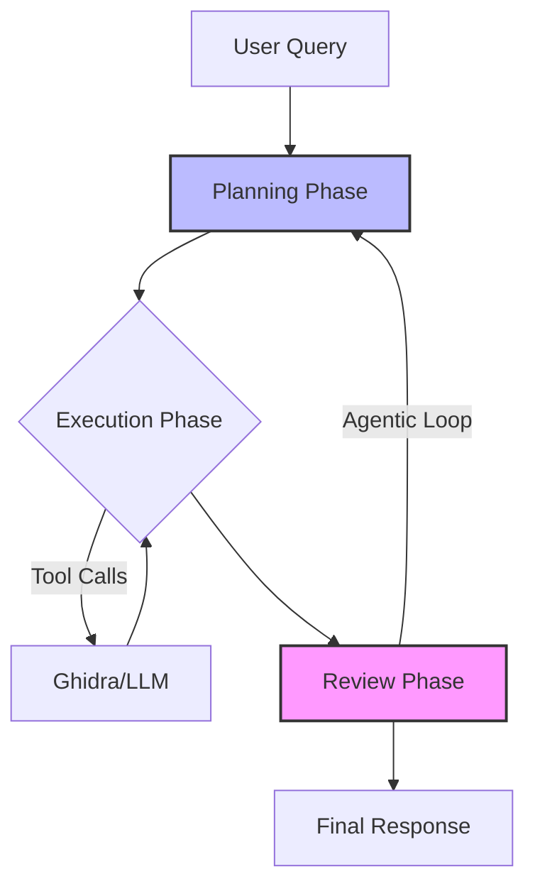

# OGhidra3 - AI-Powered Reverse Engineering with Ghidra


**OGhidra** bridges Large Language Models with Ghidra's reverse engineering platform, enabling AI-driven binary analysis through natural language. Analyze binaries conversationally, automate complex workflows, and maintain complete privacy with local AI models.


**THIS IS A YOUTUBE LINK**

[](https://www.youtube.com/watch?v=hBD92FUgR0Y)

---

## What is OGhidra?

OGhidra enhances Ghidra with AI capabilities, allowing you to:

- **Natural Language Analysis** - Ask questions about functions, strings, imports in plain English
- **Automated Workflows** - Rename functions, detect patterns, generate comprehensive reports
- **Local AI Models** - Complete privacy with models running on your hardware (Ollama)
- **Cloud AI Support** - Connect to external APIs (OpenAI, Google Gemini, Anthropic Claude)
- **Malware Detection** - Automatic pattern matching for 12+ evasion and injection techniques
- **Smart Enumeration** - Build queryable knowledge graphs from binary analysis
- **Multi-Instance Analysis** - Run multiple Ghidra instances for parallel analysis

### How It Works



**Agentic Loop**: OGhidra uses an adaptive planning system. After each execution cycle, results are reviewed and the AI can choose to gather more information or refine its analysis before providing the final response.

---

## Quick Start

### Prerequisites

1. **Python 3.12+** - Check version: `python --version`
2. **Ghidra 12.0.3** (Recommended) - Download from [Ghidra Releases](https://github.com/NationalSecurityAgency/ghidra/releases)
   - Minimum supported: Ghidra 11.0.3+
   - Tested with: Ghidra 11.0.3, 11.3.2, 12.0.2, 12.0.3
3. **Java 17+** - Required for Ghidra: `java -version`
4. **Ollama** (for local models) - Install from [ollama.com](https://ollama.com/)

### Installation

```bash
# Clone repository
git clone https://github.com/LLNL/OGhidra.git
cd OGhidra

# Install dependencies (choose one)
uv sync                          # Using UV (recommended)
pip install -r requirements.txt  # Using pip

# Configure environment
cp .env.example .env
# Edit .env with your settings
```

### Setup Ghidra Plugin

The OGhidraMCP plugin supports both Ghidra 11.3.2+ and Ghidra 12.0.3 (recommended).
Theres also a youtube video https://www.youtube.com/watch?v=hBD92FUgR0Y 

1. **Extract the OGhidraMCP plugin**:
   ```bash
   # The plugin is: OGhidraMCP_1-9.zip or OGhidra_1-9_11.zip for the Ghidra 11.3.2
   ```

2. **Install in Ghidra**:
   - Open Ghidra → **File** → **Install Extensions**
   - Click **Add Extension** (green plus icon)
   - Navigate to extracted `OGhidraMCP` folder
   - Restart Ghidra

3. **Enable the plugin**:
   - Open a Ghidra project
   - **File** → **Configure** → **Enable Developer**
   - Check the box to enable
   - The server will start on `http://localhost:8080/methods`
     
   > **YOU NEED TO HAVE CODE BROWSER OPEN**
   > **Note**: The plugin is compatible with Ghidra 11.0.3+ and optimized for Ghidra 12.0.3

### Pull AI Models

```bash
# For Ollama (local models)
ollama pull gemma3:27b           		# Good balance (20GB RAM)
ollama pull nomic-embed-text     		# Embedding model for RAG

# Alternative models
ollama pull gpt-oss:120b         		# High quality (80GB RAM)
ollama pull devstral-2:123b 			# High quality (80GB RAM) 
ollama pull devstral-2:123b-cloud       # Cloud Model 
```

### Launch OGhidra

```bash
# GUI Mode (recommended)
uv run main.py --ui

# Interactive CLI
uv run main.py --interactive

# Test connection
health
```

---

## Configuration

Edit `.env` to configure your AI provider:

### Option 1: Local Models (Ollama)

```env
LLM_PROVIDER=ollama
OLLAMA_BASE_URL=http://localhost:11434/
OLLAMA_MODEL=gemma3:27b
OLLAMA_EMBEDDING_MODEL=nomic-embed-text
```

### Option 2: External APIs

```env
LLM_PROVIDER=external
EXTERNAL_PROVIDER=google
EXTERNAL_API_KEY=your-api-key-here
EXTERNAL_MODEL=gemini-3-flash-preview
EXTERNAL_EMBEDDING_MODEL=gemini-embedding-001
```

### Option 3: Custom OpenAI-Compatible API

```env
LLM_PROVIDER=custom_api
CUSTOM_API_URL=https://api.example.com/v1/chat/completions
CUSTOM_API_KEY=your-api-key-here
CUSTOM_API_MODEL=your-model-name
CUSTOM_API_EMBEDDING_MODEL=your-embedding-model
```

### Context Management Settings

Adjust based on your model's context window:

```env
# Context budget in tokens (adjust to your model's limit)
CONTEXT_BUDGET=100000              # 100K tokens for mid-size models
                                   # 200K+ for frontier models

# Execution settings
MAX_EXECUTION_STEPS=5              # Steps per planning cycle
MAX_AGENTIC_CYCLES=3               # How many plan-execute-review loops
AGENTIC_LOOP_ENABLED=true          # Enable adaptive replanning
```

---

## Key Features

### 1. Smart Tool Buttons (GUI)

One-click access to common reverse engineering tasks:

| Tool | Description |
|------|-------------|
| **Analyze Current Function** | Deep dive into selected function's behavior |
| **Rename Current Function** | AI suggests meaningful names based on analysis |
| **Rename All Functions** | Bulk rename with Smart Enumeration options |
| **Analyze Imports** | Identify libraries and external dependencies |
| **Analyze Strings** | Find URLs, credentials, configuration data |
| **Generate Report** | Comprehensive security assessment |

### 2. Task Modes

Set specialized analysis goals:

```python
# In GUI: Use "Task Mode" dropdown
# In CLI: set task_mode <mode>

task_mode malware      # Malware analysis with pattern detection
task_mode vuln         # Vulnerability research focus
task_mode general      # General reverse engineering
```

### 3. Malware Pattern Detection

Automatic detection of 12+ malware patterns:
- **Evasion**: PEB Walking, Dynamic API Resolution, Anti-Debug, Anti-VM
- **Injection**: Process Injection (Local/Remote)
- **Persistence**: Registry, File System Hooks
- **Obfuscation**: String Encoding, API Hashing
- **Privilege Escalation**: Token manipulation, UAC bypass

Patterns trigger automatic alerts in the AI's context with MITRE ATT&CK mappings.

### 4. Smart Enumeration

Build rich, queryable knowledge from binary analysis:

```
# Enumerate all functions with AI summaries
# Choose from:
- Rename Only: Only process generic function names
- Smart Enumeration: Focus on security-relevant functions
- Full Enumeration: Analyze every function in the binary
```

Features:
- Structured metadata extraction (LOC, complexity, operations)
- Semantic search optimization
- Intent-based context assembly
- Multi-vector support for precise retrieval

### 5. Session Management

Save and restore analysis sessions:

```python
# Save progress
File → Save Session

# Load previous work
File → Load Session

# Auto-save after bulk operations
# Sessions include:
- Analyzed functions with summaries
- RAG vectors for semantic search
- Performance statistics
- UI state
```

---

## Common Workflows

### Analyze a Suspicious Binary

1. **Load binary in Ghidra** and open in CodeBrowser
2. **Enable OGhidraMCP plugin** (File → Configure)
3. **Launch OGhidra**: `uv run main.py --ui`
4. **Set task mode**: Select "malware" from dropdown
5. **Run Smart Enumeration**: Click "Rename All Functions" → "Smart Enumeration"
6. **Ask questions**: "What are the high-risk functions?" or "Show me network communication"

### Generate Security Report

```bash
# In GUI: Click "Generate Report" button
# Report includes:
- Executive Summary
- Function Inventory (renamed functions with behavior)
- Security Analysis (high-risk functions, patterns)
- Import Analysis
- String Analysis
- Recommendations
```

### Investigate Specific Function

1. **Navigate to function in Ghidra**
2. **Click "Analyze Current Function"**
3. **Ask follow-up questions**:
   - "What does this function do?"
   - "Is this vulnerable to buffer overflow?"
   - "What other functions call this?"

---

## Advanced Features

### RAG (Retrieval-Augmented Generation)

OGhidra uses vector embeddings for semantic search over analyzed functions:

```env
# Enable in .env
RESULT_CACHE_ENABLED=true
TIERED_CONTEXT_ENABLED=true
```

Benefits:
- Remember previous analysis across sessions
- Find similar functions semantically
- Reduce redundant LLM calls


### Context Optimization

Tiered context compression keeps relevant information:

```env
CURRENT_LOOP_MAX_CHARS=2000   # Recent: full detail
PREV_LOOP_MAX_CHARS=400       # Previous: summaries
OLDER_LOOP_MAX_CHARS=100      # Older: references only
```

### LLM Logging

Track all AI interactions for debugging:

```env
LLM_LOGGING_ENABLED=true
LLM_LOG_FILE=logs/llm_interactions.log
LLM_LOG_FORMAT=json
```

---

## Troubleshooting

### Ghidra Connection Issues

```bash
# Verify plugin is loaded
# Open up codebrowser! 

# Check server is running
curl http://localhost:8080/methods
```


### Ollama Connection Issues

```bash
# Verify Ollama is running
ollama list

# Check connectivity
curl http://localhost:11434/api/tags

# Restart Ollama service
ollama serve
```

### Empty Responses / Context Overflow

```env
# Reduce context budget
CONTEXT_BUDGET=50000

# Enable compaction
COMPACTION_ENABLED=true
COMPACTION_THRESHOLD=0.75
```

### Slow Performance

1. **Use smaller models**: Switch to `gemma3:9b`
2. **Reduce parallel workers**: Set `max_workers=2` in bulk operations
3. **Disable vector embeddings**: `RESULT_CACHE_ENABLED=false`
4. **Increase request delay**: `CUSTOM_API_REQUEST_DELAY=2.0`

---

## Architecture Overview

```
┌─────────────────────────────────────────────────────────────┐
│                        OGhidra UI                           │
│                  (GUI / Interactive CLI)                    │
└────────────────────────┬────────────────────────────────────┘
                         │
                         ▼
┌─────────────────────────────────────────────────────────────┐
│                   Bridge (src/bridge.py)                    │
│  ┌────────────────────────────────────────────────────────┐ │
│  │ • Agentic Loop: Plan → Execute → Review → Replan       │ │
│  │ • Tool Router: Ghidra client, LLM client, CAG manager  │ │
│  │ • Context Manager: Budget allocation, compression      │ │
│  └────────────────────────────────────────────────────────┘ │
└───────────┬────────────────────────┬────────────────────────┘
            │                        │
            ▼                        ▼
┌───────────────────────┐  ┌─────────────────────────┐
│   Ghidra Client       │  │   LLM Clients           │
│ • GhidraMCP Plugin    │  │ • Ollama (local)        │
│ • Binary operations   │  │ • External APIs         │
│ • Decompilation       │  │ • Custom endpoints      │
└───────────────────────┘  └─────────────────────────┘
            │                        │
            └────────────┬───────────┘
                         ▼
┌─────────────────────────────────────────────────────────────┐
│               CAG Manager (Knowledge System)                │
│  ┌────────────────────────────────────────────────────────┐ │
│  │ • Vector Store: Semantic search over functions         │ │
│  │ • Pattern Detector: 12+ malware techniques             │ │
│  │ • Metadata Extractor: Structured function analysis     │ │
│  │ • Session Store: Persistent analysis state             │ │
│  └────────────────────────────────────────────────────────┘ │
└─────────────────────────────────────────────────────────────┘
```

---

## Contributing

We welcome contributions! Areas of interest:

- **New malware patterns** for detection
- **LLM provider integrations** 
- **UI/UX improvements**
- **Performance optimizations**
- **Documentation** and examples

See [CODE_OF_CONDUCT.md](CODE_OF_CONDUCT.md) for community guidelines.

---

## Citation

If you use OGhidra in your research, please cite:

```bibtex
@software{oghidra2025,
  title = {OGhidra: AI-Powered Reverse Engineering with Ghidra},
  author = {OGhidra Contributors},
  year = {2025},
  url = {https://github.com/LLNL/OGhidra}
}
```

---

## Acknowledgments

OGhidra builds upon excellent open-source projects:

- **[Ghidra](https://github.com/NationalSecurityAgency/ghidra)** - NSA's reverse engineering platform
- **[Ollama](https://ollama.com/)** - Local LLM runtime
- **[LaurieWired/GhidraMCP](https://github.com/LaurieWired/GhidraMCP)** - Original Ghidra MCP plugin
- **[starsong/GhydraMCP](https://github.com/starsong/GhydraMCP)** - Enhanced MCP implementation

---

## License

OGhidra is distributed under the terms of the BSD 3-Clause license with a commercial license alternative.

See [LICENSE](LICENSE) and [NOTICE.md](NOTICE.md) for details.

**LLNL-CODE-2013290**

---

## Support

- **Documentation**: [AI_docs/](AI_docs/) for detailed technical documentation
- **Issues**: [GitHub Issues](https://github.com/LLNL/OGhidra/issues)
- **Discussions**: [GitHub Discussions](https://github.com/LLNL/OGhidra/discussions)
